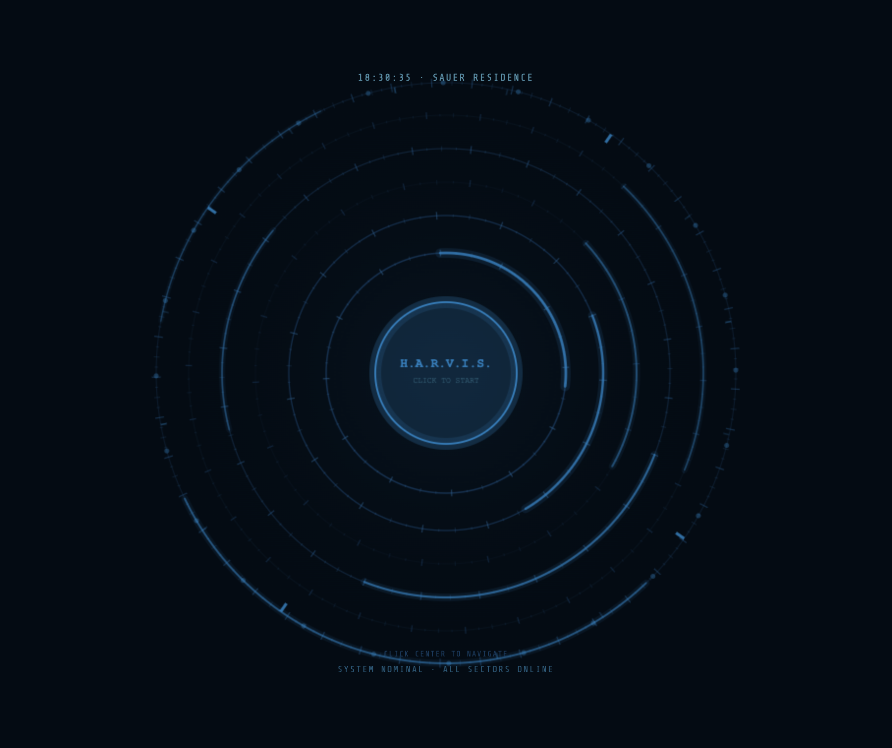

# J.A.R.V.I.S. Home Assistant Theme

A holographic HUD-style theme and navigation dashboard for Home Assistant, inspired by the Iron Man / J.A.R.V.I.S. interface.



---

## Features

- Concentric animated HUD rings with arc reactor glow
- Click-to-navigate dashboard: Center → Floors → Rooms
- Per-floor color identity (Basement: amber · First Floor: cyan · Second Floor: purple)
- Full Home Assistant theme (cards, sliders, toggles, sidebar, inputs)
- Monospace HUD typography via Share Tech Mono
- Optimized for wall-mounted tablets

---

## Requirements

| Dependency | Install via |
|---|---|
| [card-mod](https://github.com/thomasloven/lovelace-card-mod) | HACS → Frontend |
| [button-card](https://github.com/custom-cards/button-card) | HACS → Frontend |
| [browser-mod](https://github.com/thomasloven/hacs-browser_mod) | HACS → Integration *(optional, for room popups)* |

---

## Installation

### Via HACS (recommended)

1. Open HACS → Frontend
2. Click the three-dot menu → **Custom repositories**
3. Add this repo URL, category: **Theme**
4. Install **JARVIS Theme**
5. Restart Home Assistant

### Manual

1. Copy `themes/jarvis/jarvis.yaml` into your `config/themes/jarvis/` folder
2. Copy `www/jarvis/` into your `config/www/jarvis/` folder
3. Add to `configuration.yaml`:
   ```yaml
   frontend:
     themes: !include_dir_merge_named themes
   ```
4. Restart Home Assistant

---

## Dashboard Setup

1. Create a new dashboard in HA → set **Panel mode: ON**
2. Add a **Manual card** and paste the contents of `lovelace/panels/jarvis-main.yaml`
3. Set your profile theme to **jarvis**

### Adding the Google Font (recommended)

Add to your dashboard resources (Settings → Dashboards → your dashboard → Resources):

```
https://fonts.googleapis.com/css2?family=Share+Tech+Mono&display=swap
```
Type: `CSS stylesheet`

---

## Customization

### Changing floor/room names

Edit the `FLOORS` array at the top of `www/jarvis/hud.js`:

```js
const FLOORS = [
  {
    id: 'basement',
    label: 'BASEMENT',
    angle: 210,
    color: '#f59e0b',
    rgb: '245,158,11',
    rooms: ['Basement Family Room', 'Basement Workout Room', 'Basement Unfinished Area']
  },
  // ... etc
];
```

### Wiring rooms to HA views

In `www/jarvis/hud.js`, find the room click handler and add your navigation path:

```js
// navigate to a lovelace view
window.location.href = '/lovelace/' + room.toLowerCase().replace(/\s+/g, '-');

// OR fire a browser-mod popup
window.hassConnection.then(({hass}) => {
  hass.callService('browser_mod', 'popup', { title: room });
});
```

---

## File Structure

```
jarvis-ha-theme/
├── hacs.json
├── README.md
├── themes/
│   └── jarvis/
│       └── jarvis.yaml          # Full HA theme
├── lovelace/
│   ├── panels/
│   │   └── jarvis-main.yaml     # Main HUD panel card
│   └── views/
│       └── example-room.yaml    # Example room view template
├── www/
│   └── jarvis/
│       └── hud.js               # HUD navigation logic (standalone JS)
└── docs/
    └── screenshots/
        └── preview.png          # Add your own screenshot here
```

---

## License

MIT — free to use, modify, and share. Attribution appreciated but not required.

---

## Credits

Built with Home Assistant, card-mod, and button-card.
Inspired by the Marvel Cinematic Universe J.A.R.V.I.S. interface.
